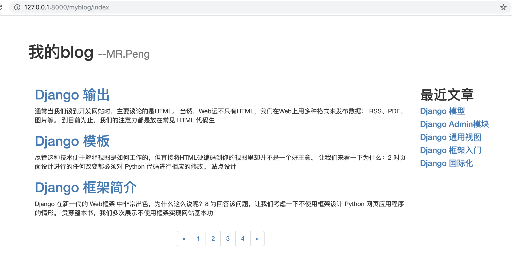
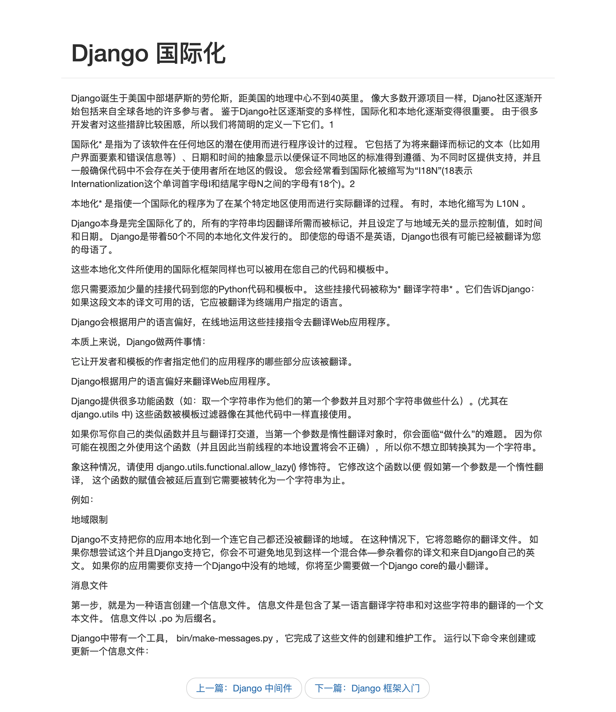

三大主流框架
（1）Django
（2）Flask
（3）Tornado

Django MVC模式
（1）模型 Model
（2）视图 View
（3）控制器 Controller

## 准备工作
1、创建项目
```
django-admin startproject <projectName>

eg:
django-admin startproject mysite
cd mysite
```

2、项目介绍
```
setting.py  # 配置文件
urls.py     # 路由配置
manage.py   # 管理文件
```

3、Django基本命令
```
python manage.py runserver # 运行Django项目
python manage.py shell     # shell环境
python manage.py test      # 执行测试
```

4、数据库相关命令
```
python manage.py makemigrations  # 创建模型变更的迁移文件
python manage.py migrate         # 执行上一个命令创建的迁移文件
python manage.py dumpdata        # 数据库导出到文件
python manage.py loaddata        # 文件导入到数据库
```

5、Django项目 Vs Django应用
每个应用可以管理自己的模型视图模板路由和静态文件
一个项目可以包含一组配置和若干个Django应用

6、创建应用
（1）新建应用
```
python manage.py startapp <appName>

eg:
python manage.py startapp myblog
```

（2）setting.py 中注册app

```python
INSTALLED_APPS = [
    # ...

    'myblog.apps.MyblogConfig'  # 这是新建的app
]
```

（3）新建视图函数
myblog/views.py
```python
from django.http import HttpResponse


def hello(request):
    return HttpResponse("hello Django")

```

（4）app中配置url
新建 myblog/urls.py 将url与视图做映射关系

```python

from django.urls import path
from . import views


urlpatterns = [
    path('hello', views.hello),
]

```

（5）项目中配置url
urls.py
```python
from django.contrib import admin
from django.urls import path, include

urlpatterns = [
    path('admin/', admin.site.urls),
    path('myblog/', include("myblog.urls")),
]
```

访问测试 http://127.0.0.1:8000/myblog/hello

7、应用目录
```
views.py   # 视图处理
models.py  # 应用模型
admin.py   # Admin模块管理对象
apps.py    # 声明应用
tests.py   # 编写应用测试用例
urls.py    # 管理应用路由（自行创建）
```

## Django模型层
视图层 <-> 模型层 <-> 数据库

1、模型层
（1）屏蔽不同数据库之间的差异
（2）便捷工据

2、settings.py 配置数据库引擎

```
DATABASES  # 选项配置数据库 默认为sqlite3
```

3、模型字段类型
（1）数字类型：IntegerField
（2）文本类型：TextField
（3）日期类型：DataTimeField
（4）自增ID： AutoField
（5）主键：   primary_key

myblog/models.py 新建文章model
```python
from django.db import models


class Article(models.Model):
    # 文章的唯一ID
    article_id = models.AutoField(primary_key=True)
    # 文章标题
    title = models.TextField()
    # 文章摘要
    brief_content = models.TextField()
    # 文章内容
    content = models.TextField()
    # 文章发布日期
    publish_date = models.DateTimeField(auto_now=True)

```

执行数据库建表操作
```
$ python manage.py makemigrations  # 生成建表操作

$ python manage.py migrate         # 执行操作

```

4、Django Shell
交互式编程
小范围测试

进入shell
```shell
python manage.py shell

from myblog.models import Article

# 新建文章
a = Article()
a.title = "文章标题"
a.brief_content = "文章摘要"
a.content = "文章内容"

print(a)

a.save()

# 查询文章
articles = Article.objects.all()
article = articles[0]
print(article.title)

```

5、Django Admin
后台管理工具
用户认证，显示管理表格，校验输入等相似功能

创建管理员用户
```
python manage.py createsuperuser
```

后台管理地址
http://127.0.0.1:8000/admin

将模型注册到admin模块
myblog/admin.py

```python
from django.contrib import admin

# Register your models here.
from .models import Article

admin.site.register(Article)

```

修改后台显示
myblog/models.py

```python
class Article(models.Model):
    # ...

    # 修改admin后台显示 Article object -> self.title
    def __str__(self):
        return self.title


```

6、数据返回

编写视图函数 
myblog/views.py
```python

from django.http import HttpResponse, JsonResponse
from .models import Article

def articles(request):
    # 查询数据 select * from article
    lst = Article.objects.values().all()
    return JsonResponse(list(lst), safe=False)

```

配置app路由
myblog/urls.py

```python
from django.urls import path
from . import views


urlpatterns = [
    path('hello', views.hello),
    # 新增路由映射
    path('articles', views.articles),
]
```

测试返回
http://127.0.0.1:8000/myblog/articles
```json
[
    {
        "article_id": 1,
        "title": "文章标题",
        "brief_content": "文章摘要",
        "content": "文章内容",
        "publish_date": "2019-09-14T14:36:32.400Z"
    },
    {
        "article_id": 2,
        "title": "这个事第二篇文章",
        "brief_content": "这个事第二篇文章的内容摘要",
        "content": "这个事第二篇文章的内容",
        "publish_date": "2019-09-14T14:36:51.387Z"
    }
]
```

## Django视图与模板
Bootstrap栅格系统，宽为12等份
https://www.bootcss.com/

1、模板系统
表现形式是文本
分离文档的表现形式和表现内容
定义了特有的标签占位符

2、基本语法
（1）变量 
```
{{name}}
```

（2）for循环 
```
 
    <li>{{item}}</li>

```

（3）if-else分支
```
 
    <p>true</p>

    <p>false</p>

```

3、渲染页面
myblog/views.py
```python
from django.shortcuts import render
from .models import Article

def index_page(request):
    lst = Article.objects.all()

    data = {
        "article_list": lst
    }
    return render(request, "myblog/index.html", data)

```

myblog/templates/myblog/index.html
```html

    <div class="page-body-main">
        <h2>{{ article.title }}</h2>
        <p>{{ article.content }}</p>
    </div>


```

4、路由参数

myblog/urls.py
```python
from django.urls import path
from . import views

# 添加命名空间
app_name = "myblog"

urlpatterns = [
    #...

    path('detail/<int:article_id>', views.detail_page, name="detail"),
]

```

传递路由参数
myblog/templates/myblog/index.html
```
<!-- 硬编码 -->
<a href="/myblog/detail/{{article.article_id}}">{{ article.title }}

<!-- 或者使用name -->
<a href="">{{ article.title }}
```

5、查询SQL日志
setting.py
```python
# 查看sql日志
LOGGING = {
    'version': 1,
    'disable_existing_loggers': False,
    'handlers': {
        'console': {
            'level': 'DEBUG',
            'class': 'logging.StreamHandler',
        },
    },
    'loggers': {
        'django.db.backends': {
            'handlers': ['console'],
            'propagate': True,
            'level': 'DEBUG',
        },
    }
}
```

6、Paginator分页

视图函数 myblog/views.py
```python

def index_page(request):
    page = request.GET.get("page", "1")
    page = int(page)

    # 并没有直接查询所有数据
    lst = Article.objects.all()
    
    # 分页,每页5个
    paginator = Paginator(lst, 5)
    current_article_list = paginator.get_page(page)

    # 上一页下一页
    if current_article_list.has_next():
        next_page = current_article_list.next_page_number()
    else:
        next_page = page

    if current_article_list.has_previous():
        previous_page = current_article_list.previous_page_number()
    else:
        previous_page = page

    data = {
        "article_list": current_article_list,
        "page_range": paginator.page_range,
        "current_page": page,
        "previous_page": previous_page,
        "next_page": next_page,

    }
    return render(request, "myblog/index.html", data)

```

模板渲染分页部分（使用Bootstrap样式）
myblog/templates/myblog/index.html
```html
 <ul class="pagination">
    <li>
        <a href="?page={{ previous_page }}" aria-label="Previous">
            <span aria-hidden="true">&laquo;</span>
        </a>
    </li>

    
        <li><a href="?page={{ page }}">{{ page }}</a></li>
    

    <li>
        <a href="?page={{ next_page }}" aria-label="Next">
            <span aria-hidden="true">&raquo;</span>
        </a>
    </li>
</ul>
```

项目截图





